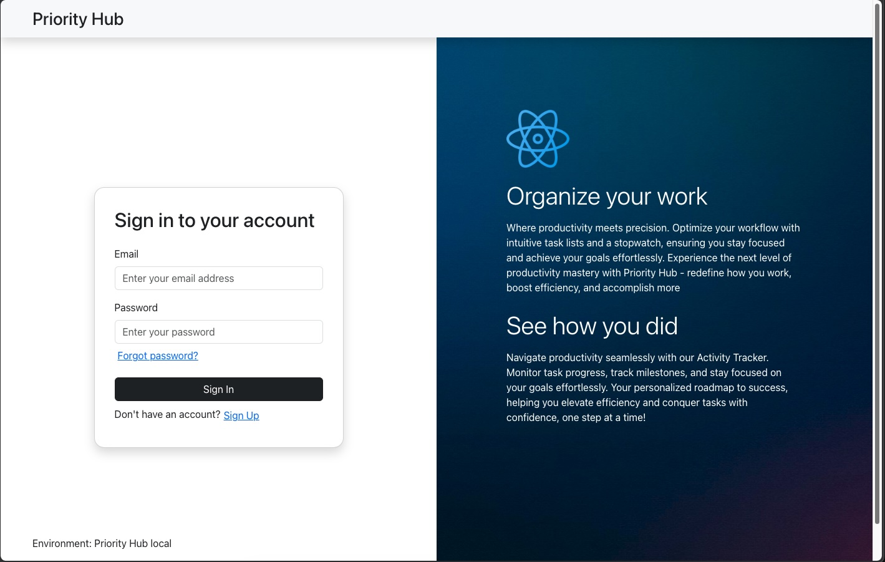
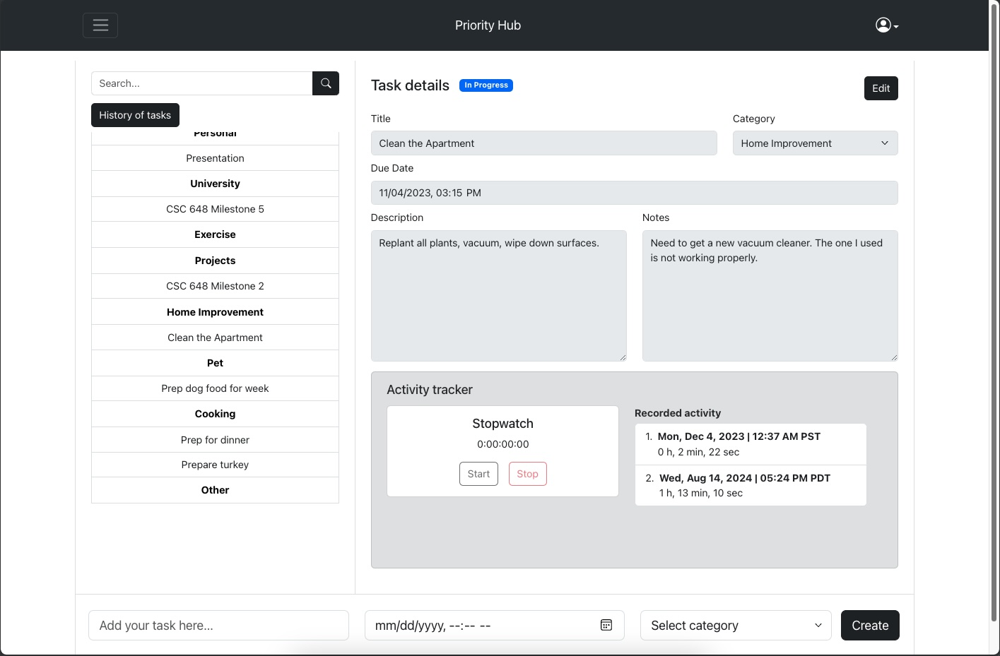
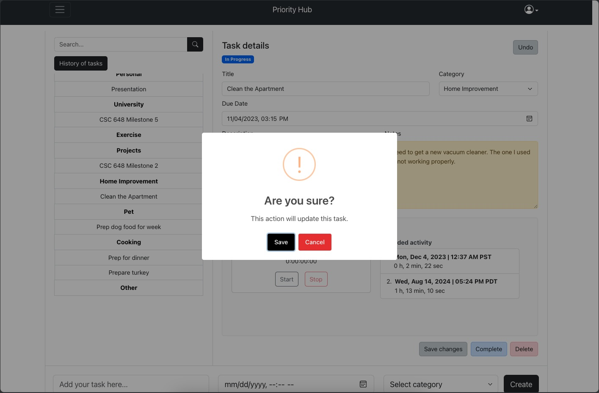
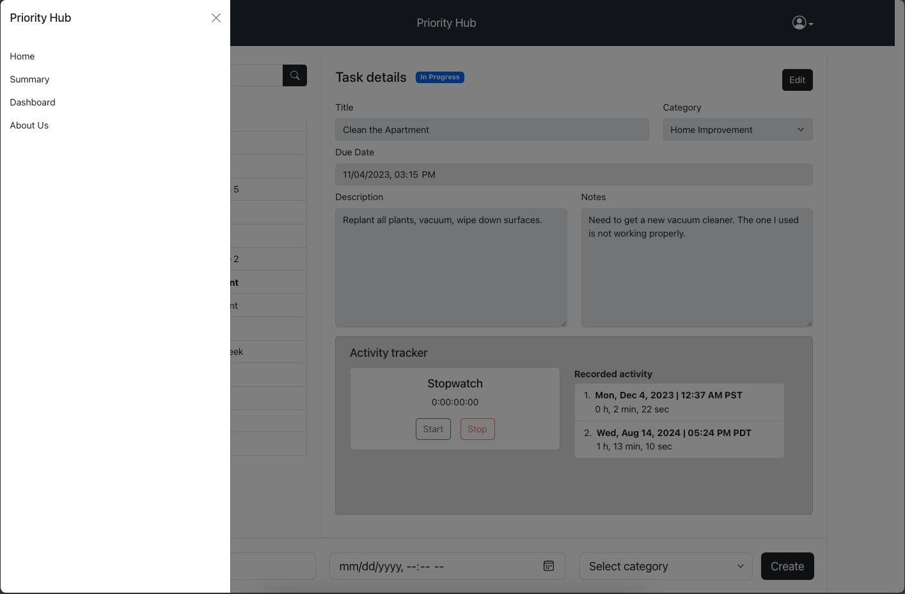
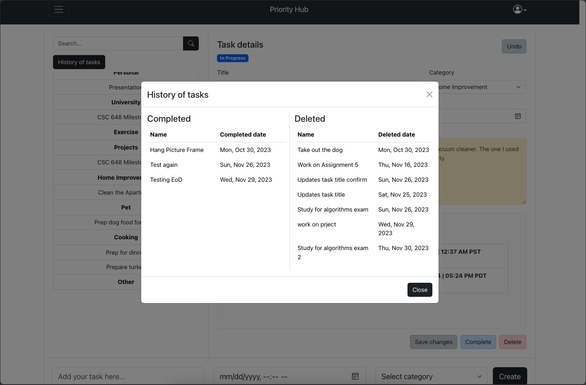
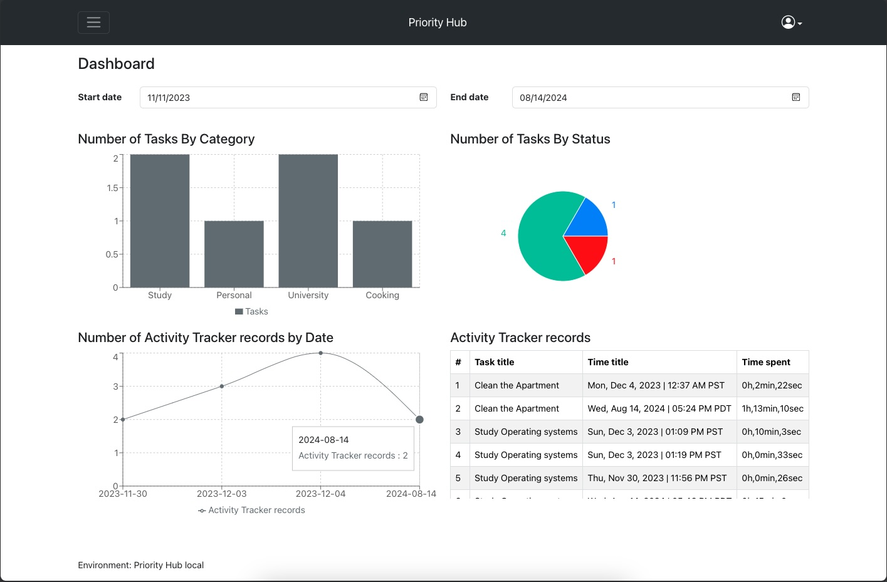
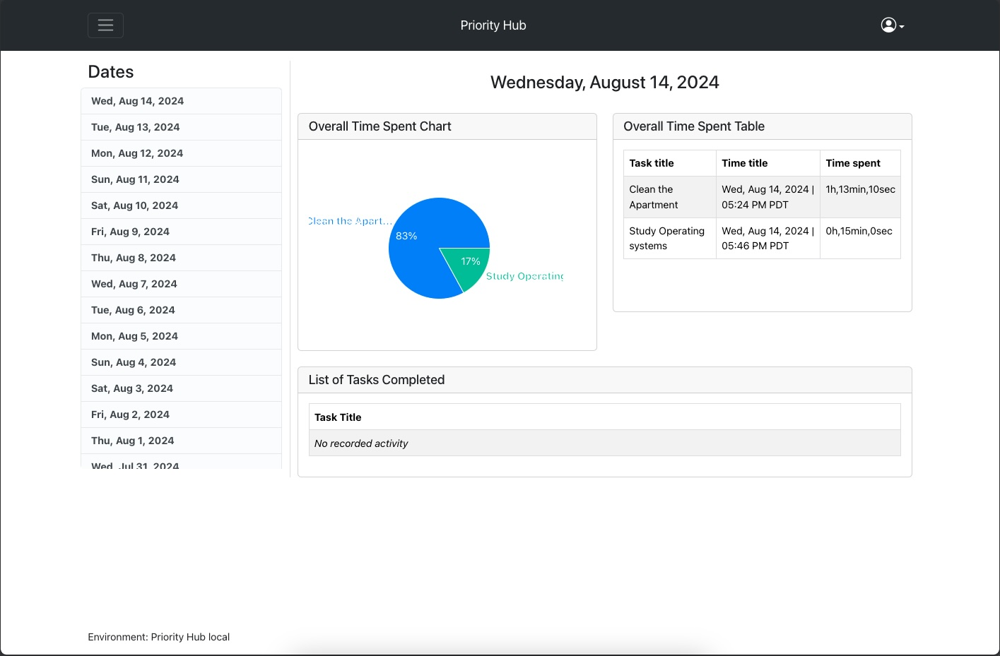

# Priority Hub

Priority Hub is a productivity web application that allows users to efficiently manage their tasks. With its user-friendly interface, the app enables users to keep track of their tasks and gain valuable insights through 8 intuitive charts.



Some of the features Priority Hub offers include:
- Authentication (sign in, sign up, sign out, reset password)
- User should be able to create a task including name, due date, priority, category, and notes.
- User should be able to edit/delete a task.
- User shall be able to browse the tasks by category.
- User shall be able to search a task by its name or code.
- User shall be able to see the history of completed/deleted tasks.
- User shall be able to keep track of the time spent in a task.
- User shall be able to start/stop a timer when keeping track of a specific task.
- User shall be able to check all time spent on specific tasks through multiple charts.
- The system shall be able to send/display the user an “End of the day” (EOD) summary including the tasks and time they spent.


## The application was built using

|       Category       |         Type           |                 Tool                   |
| :------------------: | :--------------------: | :------------------------------------: |
| Cloud infrastructure |      Cloud Server      | AWS EC2                                |
| Cloud infrastructure |    OS and Version      | Ubuntu Server 22.04 LTS                |
| Cloud infrastructure |     DB and Version     | MySQL 8.0.33                           |
| Cloud infrastructure |       Web Server       | Nginx 1.24.0                           |
| Cloud infrastructure |        Frontend        | React                                  |
| Cloud infrastructure |       Libraries        | React Bootstrap, SweetAlert2, Recharts |
|        Backend       |  Server-side language  | JavaScript (NodeJS)                    |
|        Backend       |   REST API framework   | Express                                |
|  Project Management  |     PM applications    | Jira, Confluence                       |
__________________________________________________________________________________________

## Getting started

### Prerequisites

- Have npm package installed
```
npm install npm@latest -g
```
- Have MySQL Server installed
- Create a database in MySQL using the scripts provided in the `application/database/priority-hub-db-scripts.sql` file.

### Installation

1. Clone the repository
```
git clone https://github.com/LMAR5/priority-hub-web.git
```
2. Go into the new directory
```
cd priority-hub-web
```
3. Go to the `frontend` folder 
```
cd application/frontend
```
4. Create an `.env` file with the following values:
```
REACT_APP_TITLE=Priority Hub local
REACT_APP_DESCRIPTION=Prototype for local development
REACT_APP_DEV_MODE=This is a development mode
REACT_APP_PRO_MODE=This is a production mode
REACT_APP_PORT=3000
REACT_APP_API_URL=http://localhost:3001
REACT_APP_TIMEZONE_OP=7
```
5. Go to the `backend` folder
```
cd ..
cd backend
```
6. Create an `.env` file with the following values:
```
NODE_ENV=local
API_URI=http://localhost:3001/api
PORT=3001
DB_HOST=localhost
DB_USER=<Your MySQL user>
DB_PASSW=<Your MySQL password>
DB_SCHEMA=priorityhubdb
DB_PORT=3306
API_TIMEZONE=7
```
7. Install NPM packages
```
npm i
```
8. Go to the `backend` folder and run the npm command:
```
npm run start
```
9. Go to the `frontend` folder and run the npm command:
```
npm run start
```
10. Go to your browser and access localhost:3000


## App Screenshots

### Login screen


### Home screen


### User action validation pop up


### Sidebar


### Task history


### Dashboard


### End of Day Summary

